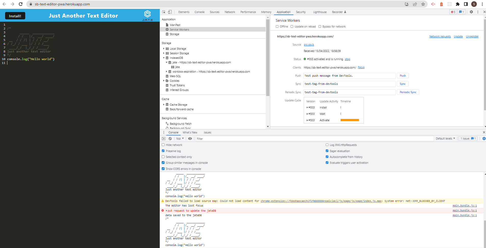

  # Text-Editor-PWA 

  ## Description
   
   Building a text editor that runs in the browser. This app is a single-page application that meets the PWA criteria. Additionally, it features a number of data persistence techniques that serve as redundancy in case one of the options is not supported by the browser. The application also function offline.

  ## Tables of Contents
  * [Instalation](#instalation)
  * [Usage](#usage)
  * [License](#license)
  * [Contributing](#contributing)
  * [Tests](#tests)
  * [Questions](#questions)
   
  ## Instalation
   
   A link to the application deployed to Heroku is here: [Text-Editor-PWA](https://text-editor-pwa-sb.herokuapp.com/)

  ## Usage

   Screenshots for the app:

   
  
  ## License
   For information about this license visit: [MIT](https://opensource.org/licenses/MIT)

  ## Contributing
   No contribution

  ## Tests
   No test

  ## Questions
  My GitHub link: [Samer-Balee](https://github.com/Samer-Balee)

  If you have any questions, please e-mail me at samerbalee@gmail.com
